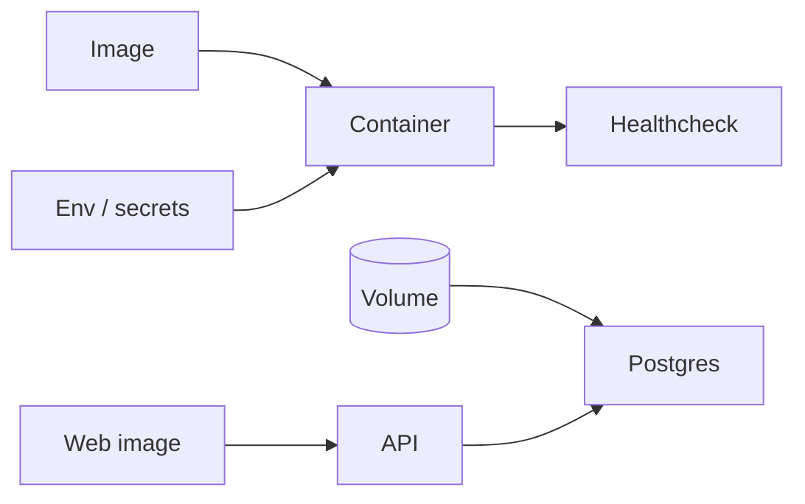

# Month 18 · Week 4 · Day 1
# Production-Shaped Docker Compose: Non-Root, Health, Volumes, Env

**Program:** Full-Stack Mastery · 18 months  
**Phase:** 7 — Capstone  
**Month index:** [../../README.md](../../README.md)  
**Week 4:** Day 1 (today) · [2](day-02.md) · [3](day-03.md) · [4](day-04.md) · [5](day-05.md) · [6](day-06.md) · [7](day-07.md)  
**Week rhythm today:** Learn + type-along (containers for **this** product)  
**Student state:** Week 3 gate is true: a person can complete the critical journey. Today the stack becomes **operable as processes**, not as two terminals you forgot to start.  
**Study time:** 3–4 focused hours

Labs: `~\fullstack-lab\month-18\week-04\day-01\` for a **tiny** non-root image drill. Product Compose lives in **your capstone**. This textbook will **not** paste a 200-line production YAML for a clinic. Month 15 skills apply; Project 7 Compose is a **habit**, not a folder to copy blindly.

---

## How to use this textbook

1. One Dockerfile for the API, one for the web (or nginx serving static), Compose for **local/staging-shaped** orchestration.  
2. Non-root user. Healthchecks. Named volumes for Postgres. Env from files that are **not** committed with secrets.  
3. `docker compose up --build` must reach `/health` without you exec-ing Python by hand.  
4. Optional review links are for later rechecking.

---

## How to read this chapter

A container is a **process with a filesystem snapshot**. Production-shaped means: it could fail health, it does not run as root, data is not trapped in an ephemeral layer, config is injected.



**Wrong belief:** “I dockerize as root and mount `.` as `/app` and call it production.”  
**Correct:** bind-mounts are a **dev** convenience. Production-shaped images **copy** the build in. The API user is not `root`.

**Wrong belief:** “Healthcheck that curls localhost is optional decoration.”  
**Correct:** Compose `depends_on: condition: service_healthy` is how the API does not start racing Postgres. Week 4 Day 7 will **kill** the database; you want health to go red.

---

## Today's contract

By the end of this day you will be able to:

1. Build an API image that runs `uvicorn` (or equivalent) as a **non-root** user.  
2. Postgres with a **volume** and a healthcheck (`pg_isready`).  
3. API healthcheck hitting `/health` or `/ready`.  
4. Env: `env_file` / Compose `environment` using **placeholders**; document required keys.  
5. Worker as a **second** service if you have a job (same image, different command).  
6. Web: multi-stage static build **or** Vite preview **only** if labeled **not production**; prefer nginx/static for the shaped file.

**Today's gate.** Closed-book:

> Compose starts Postgres healthy, API healthy, app not root. Data survives `compose down` without `-v`. Secrets are not in the Dockerfile. I did not copy Project 7 hostnames as if they were mine.

---

## Time box

| Block | Minutes | Work |
|---|---|---|
| A | 45 | Theory: users, layers, health vs ready, volumes |
| B | 50 | Lab: non-root Dockerfile toy |
| C | 80 | Capstone Compose |
| D | 15 | Git |
| E | 15 | Recall |

---

# Block A — Theory

## 1. Non-root

If the process is root, a remote code execution class of bug is immediately worse (Month 13 config risk). Create a user in the Dockerfile, `USER` that user, listen on **8000** (unprivileged). Do not require port 80 inside the API container; terminate TLS **elsewhere** (Day 2).

Illustrative fragments (not a complete product image):

```dockerfile
RUN useradd --create-home --uid 10001 appuser
USER appuser
```

Do not copy `/root`. Do not `chmod 777`.

## 2. Health vs ready

**Liveness:** process is not deadlocked. **Readiness:** it can serve (Postgres ping). A `/health` that always returns 200 even when the database is down will **lie** during Day 7’s database failure. Prefer `/ready` that `SELECT 1`s.

Keep `/health` cheap if you split them. Do not leak connection strings in the body.

## 3. Volumes

Postgres data: named volume. Object-storage **local adapter**: a volume if you still use disk. **Do not** volume-over the image’s code in the production-shaped file.

`compose down -v` **destroys** the volume. Write that in OPERATIONS in huge letters. Day 4 backup exists because of this.

## 4. Env

`DATABASE_URL` points at the Compose service name (`postgres`), not `127.0.0.1` from inside the API container (that is the API container itself). This is the classic Day 7 “bad deploy config.”

`.env` gitignored. `compose.env.example` committed.

## 5. Networks

Default Compose network is enough. Do not publish Postgres to `0.0.0.0` on the internet. Publish **8000/80** only as you need locally. Cloud Day 2 will not map 5432 publicly.

## 6. What you will not do today

- You will not write Kubernetes.  
- You will not add a service mesh.  
- You will not store AWS keys in `Dockerfile ENV`.

---

# Block B — Lab toy

```powershell
cd ~\fullstack-lab
mkdir month-18\week-04\day-01 -Force
cd ~\fullstack-lab\month-18\week-04\day-01
```

Tiny FastAPI `GET /health`. Dockerfile: non-root. Build and run:

```powershell
docker build -t lab-m18-health .
docker run --rm -p 8088:8000 lab-m18-health
```

In another window, `curl.exe http://127.0.0.1:8088/health`. Then:

```powershell
docker exec <id> whoami
```

Write `WHOAMI.md`: if it prints `root`, you failed the lab. Fix.

Windows: Docker Desktop must be running. If `docker` is missing, that is a Month 15 gap — do not skip; install/start it. Line endings: `LF` in Dockerfiles if you hit `exec format` weirdness; `.gitattributes` helps.

---

# Block C — Capstone

Write `compose.yaml` (or `compose.staging.yaml`) with **your** service names. Include:

- `postgres`  
- `api`  
- `worker` if jobs exist  
- `web`  
- healthchecks  
- `depends_on` healthy  
- `env_file`  

README: `docker compose up --build`. Migrations: **either** an init container/command **or** a documented first-run `compose run api alembic upgrade head` — Day 2 makes it a **pipeline step**. Today, at least **you** can migrate a fresh volume.

Prove: `docker compose exec api whoami` is not root. Fresh `up` after `down` (without `-v`) still has data.

**Wrong belief:** “I’ll `network_mode: host` on Windows to save time.”  
**Correct:** that hides DNS names you need to understand.

---

# Block D — Git

```powershell
cd ~\fullstack-lab
git add month-18
git commit -m "Month 18 Week 4 Day 1: non-root image gym."
```

Capstone: Dockerfiles + compose **without** secrets.

---

# Block E — Recall

1. Why non-root.  
2. Ready vs live.  
3. `127.0.0.1` inside a container.  
4. What `-v` does on `down`.  
5. Why TLS is not in the API container today.

## Office hours

**`latest` only tags.** Prefer a tag you can rollback (Day 2 SHA).  
**Healthcheck wget missing in image.** Use `python -c` or install curl in the image **deliberately**.  
**Compose file with your real password.** Rotate; gitignore.

Windows: WSL2 backend is typical; paths in volumes use Compose’s Windows handling — prefer named volumes over `C:\` binds for Postgres.

---

## Definition of done

- [ ] Lab `whoami` not root  
- [ ] Capstone Compose healthy API  
- [ ] Volume persists  
- [ ] Env example committed, secrets not  
- [ ] Worker service if jobs exist  
- [ ] README start steps  

---

## Optional review links

- [Compose file](https://docs.docker.com/compose/compose-file/)  
- [Dockerfile USER](https://docs.docker.com/reference/dockerfile/#user)  
- [Month 15 README](../../../month-15/README.md)  
- [Project 8 §15](../../../../full_stack_project_requirements_2026/project_08_independent_production_capstone.md)  

---

## Tomorrow

**CI/CD, secrets, HTTPS, migrations as a step.** A commit must be able to become an image that is **not** “I built it on my laptop once.”
