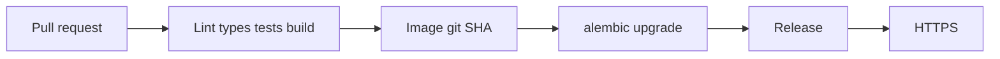

# Month 18 · Week 4 · Day 2
# CI/CD, Secrets, HTTPS, Migrations as a Step

**Program:** Full-Stack Mastery · 18 months  
**Phase:** 7 — Capstone  
**Month index:** [../../README.md](../../README.md)  
**Week 4:** [1](day-01.md) · Day 2 (today) · [3](day-03.md) · [4](day-04.md) · [5](day-05.md) · [6](day-06.md) · [7](day-07.md)  
**Week rhythm today:** Exercises + wiring **your** pipeline  
**Student state:** Compose runs locally. Today a **commit** can be checked and **promoted** with **migrations as a deliberate step**, secrets in a **store**, and **HTTPS** on the public URL (or a written gap if AWS is still blocked — honesty, not localhost-as-prod).  
**Study time:** 3–4 focused hours (cloud accounts add time; log a second session)

Labs: `~\fullstack-lab\month-18\week-04\day-02\` for a **workflow sketch**. Real workflows in **your** GitHub repo. Month 16 skills; this is **Project 8**, not a copy of Project 7’s YAML with the old name.

---

## How to use this textbook

1. CI on pull request: lint, types, tests, build.  
2. CD: image tagged with **git SHA**; migrate; then switch traffic.  
3. Secrets never in git. HTTPS is not “later.”  
4. Optional review links are for later rechecking.

---

## How to read this chapter

CI is a **gate**. CD is a **known artifact** moving through environments. `git pull` on a snowflake VM is not CD (Month 16 README).



**Wrong belief:** “I’ll SSH and pull. The exam will understand.”  
**Correct:** Project 8 §14 wants reproducible steps, migrations, environment separation, rollback.

**Wrong belief:** “The API can `create_all` on boot so I do not need a migrate step.”  
**Correct:** that is not history. Two instances racing `create_all` is not a team.

---

## Today's contract

By the end of this day you will be able to:

1. GitHub Actions (or the CI you used in Month 16) on the capstone: **ruff**, **pytest** (with Postgres service if needed), **frontend** lint/type/test/build.  
2. Image build tagged `git SHA`.  
3. Deploy doc: **migrate then start** (or migrate job then roll API).  
4. Secrets in GitHub Actions secrets / AWS SM / SSM — **list the names**, not the values.  
5. HTTPS: ACM + DNS or Caddy/nginx — **your** Month 16 path. If no account, **diagram + Compose TLS-less staging** and a dated gap; do **not** call it production.  
6. Rollback: previous SHA; **what happens to migrations** (expand/contract honesty).

**Today's gate.** Closed-book:

> A required check can stop a bad commit. Migrations are a step. Secrets are in a store. The public URL, if I claim production, is HTTPS.

---

## Time box

| Block | Minutes | Work |
|---|---|---|
| A | 40 | Theory: gates, migrate order, TLS, rollback |
| B | 45 | Exercises: order the pipeline; find secret leaks |
| C | 90 | Independent: workflows + DEPLOYMENT.md truth |
| D | 15 | Git |
| E | 15 | Recall |

---

# Block A — Theory

## 1. CI must actually fail

Optional checks are decoration. Branch protection or an honest “we do not merge red” documented for a solo exam. `--no-verify` locally is not a server skip.

Jobs: backend tests need a **database**. Service containers on Actions. Do not point CI at production RDS.

## 2. Migrations as a step

Order:

1. Expand schema (nullable new columns)  
2. Deploy code that writes both  
3. Backfill  
4. Constrain  

For this capstone, a **single** `alembic upgrade head` **before** new API tasks start is the minimum. If a migration is **destructive**, stop and write the plan; do not `downgrade` blindly.

Worker and API versions: incompatible jobs are a failure class (Day 7). Prefer **same SHA** for api and worker.

## 3. Secrets

| Place | Allowed? |
|---|---|
| Git | No |
| GitHub Secrets / AWS | Yes |
| Vite `VITE_` | Public only |
| Docker image layers | No keys |
| Screenshots in docs | Redact |

Rotation sentence in OPERATIONS.

## 4. HTTPS

TLS terminates at load balancer, Caddy, or nginx. HTTP-01 or DNS-01 as you learned. HSTS is optional; HTTP→HTTPS redirect is not optional for a claimed production URL.

Cookies `Secure` flag **on** in that environment.

## 5. Rollback

Image previous SHA. Database: **forward-fix** if downgrade is unsafe. Write it. A rollback that leaves API v1 on schema v2 is a Day 7 incident.

---

# Block B — Exercises

`ORDER.md`: scramble these and **sort** them: tag image, pytest, ruff, migrate, switch listener, build frontend, lint frontend.

`LEAK-HUNT.md`: list five files you grepped (`AKIA`, `BEGIN PRIVATE`, `SECRET_KEY=`). Results: none or rotate.

`MIGRATE-DRILL.md`: what if upgrade adds a NOT NULL column without default while old API still runs? Answer in 5–8 lines (expand/contract).

---

# Block C — Independent

Implement CI YAML **for this repo**. Wire secrets **names**. Update `DEPLOYMENT.md`: exact commands, environments, HTTPS, migrate step, rollback.

If AWS exists from Month 16, attach **this** app (new RDS/S3 names). Do not reuse Project 7 database.

Run one pipeline on a **dummy PR** if you can. Paste a **redacted** badge or run URL in evidence.

**Wrong belief:** “I’ll encrypt secrets with a joke password in the repo.”  
**Correct:** platform store.

---

# Block D — Git

```powershell
cd ~\fullstack-lab
git add month-18
git commit -m "Month 18 Day 2: pipeline order exercises."
```

Capstone: CI workflow without secrets.

---

# Block E — Recall

1. Why create_all is not CD.  
2. Same SHA api+worker.  
3. What Vite may not contain.  
4. Rollback vs schema.  
5. Why 5432 should not be public.

## A workflow shape (illustrative, not a paste-in)

You already wrote Actions in Month 16. Today the **jobs** must name **this** repo’s commands:

1. Checkout.  
2. Setup Python/Node versions you pinned.  
3. `uv sync` / `npm ci`.  
4. Ruff / ESLint.  
5. Typecheck if you have it.  
6. Pytest with a **Postgres service** and `TEST_DATABASE_URL`.  
7. Vitest.  
8. Frontend build.  
9. Optional: `docker build` so a Dockerfile typo fails on the PR.

CD (on `main` or a release tag): build/push image `:${{ github.sha }}`, run `alembic upgrade head` against **staging** with a secret URL, then roll the API/worker to that digest. If you cannot push to a registry yet, CI still **builds**; CD steps stay in `DEPLOYMENT.md` as commands you have **typed once** locally with a dummy registry or Compose.

**Wrong belief:** “I’ll skip pytest in CI because it needs Postgres and that’s hard.”  
**Correct:** service containers exist. A capstone whose tests only run on one laptop is not a CI gate.

**HTTPS truth table** (write yours in DEPLOYMENT.md):

| Claim | Honest evidence |
|---|---|
| Production URL | `https://…` or “no AWS yet — gap dated” |
| Redirect HTTP→HTTPS | yes / no / N/A |
| Cookie `Secure` in that env | yes / no |
| Cert issuer | Let’s Encrypt / ACM / other |

Do not write “HTTPS” if the only URL is `http://127.0.0.1`.

## Office hours

**CI only on main, never PRs.** Repair: PR gate.  
**Migrate after traffic switch.** Repair: order.  
**Let’s Encrypt on localhost.** Not production.  
**Copied Month 16 YAML with old paths.** Repair: this repo’s tests.  
**`continue-on-error: true` on pytest.** That is a badge, not a gate.  
**Secrets echoed in `echo $DATABASE_URL`.** Repair: Actions mask; never print.

Windows: Actions run on Linux VMs. Paths use `/`. Local compose remains your debug environment. CRLF in `.yml` rarely breaks Actions; a tab in YAML does.

---

## Definition of done

- [ ] ORDER.md and leak hunt  
- [ ] CI workflow exists and is understood  
- [ ] DEPLOYMENT.md has migrate step + HTTPS truth  
- [ ] Secrets named in a store  
- [ ] Rollback paragraph  
- [ ] Commit  

---

## Optional review links

- [GitHub Actions](https://docs.github.com/en/actions)  
- [Alembic](https://alembic.sqlalchemy.org/)  
- [Month 16 README](../../../month-16/README.md)  
- [Let’s Encrypt](https://letsencrypt.org/docs/)  

---

## Tomorrow

**Memory:** a **runbook** — deploy, rollback, logs, who to page (even if you page yourself).
