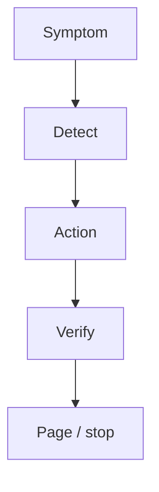

# Month 18 · Week 4 · Day 3
# From Memory: The Runbook (Deploy, Rollback, Logs, Who to Page)

**Program:** Full-Stack Mastery · 18 months  
**Phase:** 7 — Capstone  
**Month index:** [../../README.md](../../README.md)  
**Week 4:** [1](day-01.md) · [2](day-02.md) · Day 3 (today) · [4](day-04.md) · [5](day-05.md) · [6](day-06.md) · [7](day-07.md)  
**Week rhythm today:** Implement from memory (operations writing)  
**Student state:** CI/CD notes exist. Today you must **operate** without opening `DEPLOYMENT.md` first. Day 7’s incident drill will use this runbook.  
**Study time:** 3–4 focused hours  
**Prereq:** Day 2 gate passed.

Labs: `~\fullstack-lab\month-18\week-04\day-03\`. `DEPLOYMENT.md` closed during Blocks 1–3. This recap is the teacher. You will still page **yourself** — write that without irony.

---

## How Day 3 works

Allowed: this file; blank editor.

Not allowed: copying Project 7 runbook; AI generating a fake PagerDuty essay; opening AWS console “to remember” during Block 1.

Stuck >25 minutes: open **only** yesterday’s DEPLOYMENT section, close it, continue. `lookups.txt`.

---

## How to read this chapter

A **runbook** is a procedure a tired person can follow. It is not a marketing README.



**Wrong belief:** “I’m solo, so I do not need a runbook.”  
**Correct:** you are the on-call. Future you at 1 a.m. is a different engineer.

**Wrong belief:** “Logs are `docker compose logs` and that is the whole observability story.”  
**Correct:** you need **where**, **how to filter by request_id**, and **what healthy looks like**.

---

## Complete explanation (operations you must still own)

**Deploy.** Artifact SHA. Env. Migrate. Start/replace API and worker **same SHA**. Verify `/ready`, a login, one list. Record the SHA in a `RELEASES.md` line.

**Rollback.** Previous SHA. If schema moved forward unsafely, rollback is a **forward fix** or a restore (Day 4) — say which. Never “theoretically downgrade” if you have not tried.

**Logs.** Structured. `request_id`. Command **examples** for Compose (`docker compose logs api --since 10m`) and for CloudWatch/equivalent **if** you have it. Do not dump secrets.

**Metrics.** Traffic, latency, errors — even if today that is a Compose dashboard or CloudWatch. Health failing is a metric.

**Who to page.** Table: API 5xx spike → you; data loss fear → you + stop deploys; leaked secret → you + rotate. Phone/email **you actually will hear**. A Slack webhook to a channel you never open is theater.

**When not to deploy.** Red CI. Unapplied mystery migration. Friday optional for learning — honesty.

**Bad config class.** `DATABASE_URL` pointing at the container’s localhost; wrong CORS origin; `Secure` cookies on HTTP; worker missing env. The runbook has a **config checklist**.

**Wrong belief:** “I’ll remember kubectl.”  
**Correct:** you probably do not have a cluster. Write **your** actual commands.

---

## Today's contract

1. Closed-book `RUNBOOK-DRAFT.md` covering deploy, rollback, logs, paging.  
2. Mini: order a broken deploy narrative.  
3. Diff against DEPLOYMENT.md; publish `OPERATIONS.md` / runbook in the capstone.  
4. A one-page “who to page” even if it is your name four times.

**Today's gate.** Closed-book:

> I can deploy, roll back, find a request_id, and name who is on-call — me — without hunting through chat history.

---

## Time box

| Block | Minutes | Work |
|---|---|---|
| 0 | 20 | Speak recap |
| 1 | 40 | Runbook from memory |
| 2 | 30 | Mini incident order |
| 3 | 40 | Diff + publish OPERATIONS.md |
| 4 | 30 | Tabletop: “API 500s after deploy” |
| 5 | 15 | Retro |

---

# Block 0 — Speak

SHA; migrate; same worker version; request_id; page yourself.

---

# Block 1 — Draft (40 min)

`RUNBOOK-DRAFT.md` sections **required**:

1. Preconditions (CI green, secrets present)  
2. Deploy steps (numbered)  
3. Verify steps  
4. Rollback steps  
5. Log commands  
6. Page table  
7. Config checklist (DATABASE_URL host, CORS, cookie flags)  
8. Stop-the-line (data deletion, secret leak)

Use **your** service names from memory. If you cannot remember them, that is data.

---

# Block 2 — Mini (30 min)

Narrative (imposed): “After release, users cannot log in. Health is 200. Logs show DB connection to 127.0.0.1. Worker is still old SHA.”

Write `mini-order.md`: **first five actions** in order. Then `mini-root.md`: hypothesized cause (bad config + mixed SHA). Do not exploit anything; this is operations.

---

# Block 3 — Diff

Open DEPLOYMENT.md. Merge truth into capstone `OPERATIONS.md` (Project 8 §20). Delete commands that do not exist.

---

# Block 4 — Tabletop

`tabletop.md`: API 500 after deploy. Detection, first log query, rollback yes/no, who you notify (even a friend). 15 lines.

---

# Block 5 — Retro

Did you write “check the logs” without a command?

```powershell
cd ~\fullstack-lab
git add month-18
git commit -m "Month 18 Day 3: runbook from memory."
```

---

## Worked mini (after)

Reasonable first actions: **do not** push more commits blindly; compare `DATABASE_URL`; confirm worker SHA; inspect login logs for connection errors; consider rollback of API to last known good **with** matching worker. Health 200 with `/health` that does not check DB is a **lie** — add ready check (Day 1).

If your first action was “restart Windows,” re-read.

---

## Debug A–C

**A.** Runbook is a link to a YouTube deploy. **B.** Page table empty. **C.** Rollback is `git push --force`.

Repairs: commands; your name; never force-push main as rollback of production data.

## What “who to page” looks like when you are the staff

Write a table even if every cell is your name. The **trigger** still changes the **action**:

| Trigger | First action | Escalate |
|---|---|---|
| Ready check red 3 minutes | Compose/cloud: is Postgres up? | Restore from backup if disk died |
| 5xx spike after deploy | Rollback to previous SHA (same worker) | Leave a note in INCIDENTS.md |
| Users cannot log in; health green | Config checklist (`DATABASE_URL`, CORS, cookies) | Fix env; do not “add JWT” |
| Job failures climbing | Worker logs; mailer port; poison message | Pause enqueue if flooding a vendor |
| Secret in a gist/log | Rotate **now**; assume leak | Rewrite history only if you understand the cost |

A page is useless if it goes to an email you never read. Use a phone notification you actually hear, even if that is a personal SMS from a cloud alarm.

**Wrong belief:** “I’ll page myself by watching the terminal.”  
**Correct:** you will close the terminal. Alerts exist so detection does not require staring.

**Say it.** Closed-book: three commands to fetch last ten minutes of API logs; the SHA you would roll back to; the difference between `/health` and `/ready`. If you cannot, Block 3’s OPERATIONS.md is still a draft.

Windows: `docker compose logs api --since 10m` from the directory that contains `compose.yaml`. If the shell cannot find Docker, Desktop is not running — that belongs in the runbook as a **local** failure, not as a cloud mystery.

Log grep examples you should be able to recite (adjust names):

```powershell
docker compose logs api --since 15m | Select-String "request_id"
docker compose logs worker --since 15m | Select-String "failed"
```

If your logs are JSON lines, search the field, not a sentence you hope uvicorn printed. Put the exact `Select-String` (or `findstr`) in OPERATIONS.md so Day 7 is copy-from-runbook, not archaeology.

If you have CloudWatch (or equivalent), add **one** filter example for `request_id` there too. Two backends, one idea.

Tomorrow you will dump and restore. Tonight, name the volume that dump would protect. If you cannot name it, Compose is not production-shaped yet.

---

## Definition of done

- [ ] RUNBOOK-DRAFT.md from memory  
- [ ] mini-order.md  
- [ ] OPERATIONS.md in capstone  
- [ ] Page table  
- [ ] tabletop.md  
- [ ] Commit  

---

## Optional review links

- [Project 8 §14, §20](../../../../full_stack_project_requirements_2026/project_08_independent_production_capstone.md)  
- [Google SRE: incident response](https://sre.google/sre-book/managing-incidents/) — later, ideas not a copy  

---

## Tomorrow

**Monitoring, backup strategy and a restore rehearsal idea, small load test, performance note** (baseline, bottleneck, change, result).
