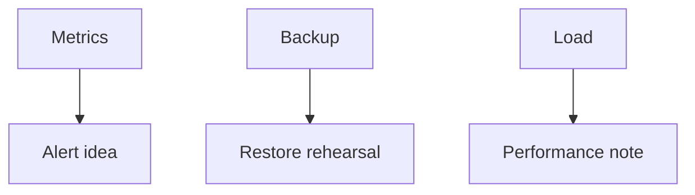

# Month 18 · Week 4 · Day 4
# Monitoring, Backup Strategy, Restore Rehearsal, Load Test, Performance Note

**Program:** Full-Stack Mastery · 18 months  
**Phase:** 7 — Capstone  
**Month index:** [../../README.md](../../README.md)  
**Week 4:** [1](day-01.md) · [2](day-02.md) · [3](day-03.md) · Day 4 (today) · [5](day-05.md) · [6](day-06.md) · [7](day-07.md)  
**Week rhythm today:** Lab (measure and rehearse, not hope)  
**Student state:** A runbook exists. Today you **see** the system, **plan backups** with a restore **idea you could run**, run a **small** load test, and write a **performance note**.  
**Study time:** 3–4 focused hours

Labs: `~\fullstack-lab\month-18\week-04\day-04\` for a **tiny** load-script gym. Product metrics/backups in **your capstone**. This textbook will **not** claim four nines for you. Month 17 measurement habits apply.

---

## How to use this textbook

1. Metrics: traffic, latency, errors — at least.  
2. Backup: what, where, RPO/RTO **honest** bounds, restore rehearsal **steps**.  
3. Load test **small**; stop if you might incur surprise cloud cost.  
4. Optional review links are for later rechecking.

---

## How to read this chapter

Hope is not a backup strategy. Averages are not p95. A load test that melts a shared RDS you cannot pay for is not professionalism.



**Wrong belief:** “RDS automated backups exist, so I am done.”  
**Correct:** you must **say** what is restored (Postgres, not Redis cache), **how much** you could lose (RPO), **how** you would restore (steps), and **rehearse** or **simulate** once (Project 8 §16).

**Wrong belief:** “I’ll wrk a million requests at the production URL to look senior.”  
**Correct:** small, **staging or local**, documented rate. Production load tests without permission and budget are how you get a bill and an outage.

---

## Today's contract

By the end of this day you will be able to:

1. Name where metrics live (CloudWatch, a `/metrics` scrape, even docker stats **plus** app logs — write the truth).  
2. Alert **idea**: error rate or health fail → you (from the runbook).  
3. `BACKUP.md`: Postgres dump/snapshot; object storage versioning or copy; what is **not** backed up (local disk adapter).  
4. Restore rehearsal: run on a **throwaway** volume/database **or** write a **timed simulation** with evidence of dump/restore on a lab DB — not production destroy.  
5. Small load test on the **hot list** or health (careful with login rate limits).  
6. `PERFORMANCE.md`: baseline, bottleneck hypothesis, **one** change, result.

**Today's gate.** Closed-book:

> I know what I would lose if the disk died tonight. I measured one path. I did not confuse cache TTL with a backup.

---

## Time box

| Block | Minutes | Work |
|---|---|---|
| A | 40 | Theory: RPO/RTO, what restore means, p95, load ethics |
| B | 50 | Lab: dump/restore toy + tiny load |
| C | 85 | Capstone: BACKUP.md, restore evidence, load, PERFORMANCE.md |
| D | 15 | Git |
| E | 15 | Recall |

---

# Block A — Theory

## 1. Monitoring

Minimum: **traffic** (req/s), **latency** (p95 if you can; else p50 + max with honesty), **errors** (5xx count). Health/readiness. Logs already structured.

Alerts should **wake** you for: health red for N minutes; 5xx rate; worker failed jobs spike. Do not alert on every 404.

Frontend errors: a simple reporter or log — Week 4 Day 7 will **throw** in the UI on purpose.

## 2. Backup strategy

| Asset | Typical method | Lost if skipped |
|---|---|---|
| Postgres | snapshot or `pg_dump` | all rows |
| Object storage | bucket versioning / replicate | uploads |
| Redis | optional; treat as **rebuildable** | cache only if you designed that |
| Git | already | source, not customer data |

**RPO:** how much time of data you can lose (e.g. “up to 24h if daily dumps”).  
**RTO:** how long to serve again.

Write **both** as learning numbers, not bank numbers.

## 3. Restore rehearsal idea

A valid rehearsal:

- Create a lab database.  
- `pg_dump` capstone **dev** (not prod customers if any).  
- Restore into a **new** database name.  
- `SELECT count(*)` matches.  
- Time it. Write minutes.

A valid **simulation** if dump of prod is dangerous: restore last snapshot to a **new** instance and read-only check — then **tear down** to save cost.

Invalid: “I would click restore in the console” with no evidence.

## 4. Load test

Tools you may already know: `hey`, `k6`, locust, even a **short** Python loop. Hit **staging/local**. Warm up. Record: concurrency, duration, p95, error rate.

Stop conditions: errors climb, you are on a billable URL, laptop fans become the bottleneck (say so).

## 5. Performance note shape (Month 17)

1. **Baseline** (numbers).  
2. **Bottleneck** (EXPLAIN, waterfall, N+1).  
3. **Change** (index you already justified, or a query fix — **one**).  
4. **Result** (numbers).  

If the change did nothing, that is a **valid** note. Do not invent a 10×.

## 6. What you will not do today

- You will not flood anyone’s production.  
- You will not delete production to “practice restore.”  
- You will not add Redis as a trophy cache without invalidation.

---

# Block B — Lab

```powershell
cd ~\fullstack-lab
mkdir month-18\week-04\day-04 -Force
cd ~\fullstack-lab\month-18\week-04\day-04
```

Toy: SQLite or Postgres `notes` table, two rows. Dump, delete, restore, count=2. Write `TOY-RESTORE.md` with times.

Tiny load: 50 requests to capstone `/health` **local**. A short Python loop you type is enough if you do not have `hey`:

```python
import urllib.request
for i in range(50):
    urllib.request.urlopen("http://127.0.0.1:8000/health")
```

Write `TOY-LOAD.md`: counts and whether any failed. This gym is **health**, not a login lockout.

---

# Block C — Capstone

1. `docs/BACKUP.md` — strategy.  
2. Restore evidence in `docs/RESTORE-REHEARSAL.md`.  
3. Metrics: enable what you can; screenshot **redacted**.  
4. Load test on **hot path** with **test user** or on a safe GET.  
5. `docs/PERFORMANCE.md` four-part note.  
6. Update OPERATIONS with backup schedule.

If you cannot snapshot AWS, **daily dump script** + rehearsal is enough for the learning gate **if** you say what prod would use.

**Wrong belief:** “Object storage is immortal.”  
**Correct:** buckets get deleted. Versioning is a choice you write down.

---

# Block D — Git

```powershell
cd ~\fullstack-lab
git add month-18
git commit -m "Month 18 Day 4: toy restore and load notes."
```

Do not commit dumps that contain personal data.

---

# Block E — Recall

1. RPO vs RTO.  
2. Why Redis often is not in the backup.  
3. Why production load tests need care.  
4. Four parts of a performance note.  
5. What a fake restore looks like.

## Office hours

**Dump in git.** No — treat as data, not source.  
**Load test login until lockout.** You rate-limited yourself (good) — use `/health` or a GET list with a session.  
**Index every column after one slow test.** Repair: EXPLAIN first.

Windows: `pg_dump` from PATH or Docker `compose exec postgres pg_dump`. Paths with spaces need quotes.

---

## Definition of done

- [ ] Toy restore  
- [ ] BACKUP.md with RPO/RTO honesty  
- [ ] Restore rehearsal evidence  
- [ ] Small load numbers  
- [ ] PERFORMANCE.md  
- [ ] No dumps of real PII in git  

---

## Optional review links

- [Postgres dump/restore](https://www.postgresql.org/docs/current/backup-dump.html)  
- [Project 8 §§11, 13, 16](../../../../full_stack_project_requirements_2026/project_08_independent_production_capstone.md)  
- [Month 17 README](../../../month-17/README.md)  

---

## Tomorrow

**Security review** mapping Month 13 onto **this** product; finish **operator docs**. Defense only.
