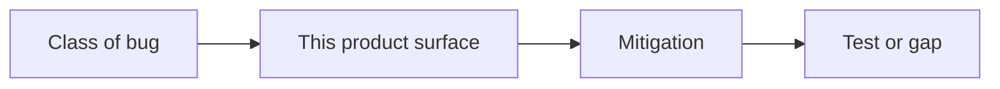

# Month 18 · Week 4 · Day 5
# Security Review on This Product; Operator Docs

**Program:** Full-Stack Mastery · 18 months  
**Phase:** 7 — Capstone  
**Month index:** [../../README.md](../../README.md)  
**Week 4:** [1](day-01.md) · [2](day-02.md) · [3](day-03.md) · [4](day-04.md) · Day 5 (today) · [6](day-06.md) · [7](day-07.md)  
**Week rhythm today:** Tests/docs (security review + operator package)  
**Student state:** Backups and metrics have a paper trail. Today you map **Month 13** onto **this** system and finish the **operator** documents Project 8 requires.  
**Study time:** 3–4 focused hours

Labs: `~\fullstack-lab\month-18\week-04\day-05\` for a **review table gym**. Canonical `SECURITY.md` in **your capstone**. This book teaches **defense**. It does not provide exploits, payloads, or intrusion recipes. You describe what someone **might try** and what **stops** it.

---

## How to use this textbook

1. Review **your** endpoints, cookies, uploads, jobs — not a poster.  
2. Every high risk needs a **test name** or an explicit gap.  
3. Operator docs are for tired you.  
4. Optional review links are for later rechecking.

---

## How to read this chapter

A security review is a **structured argument** that Month 13’s classes were **applied**. Operator docs are how Week 4 Day 7 is survivable.



**Wrong belief:** “I’ll paste OWASP Top 10 as SECURITY.md.”  
**Correct:** your resources, your deny tests, your cookie flags.

**Wrong belief:** “Review means I prove I can hack.”  
**Correct:** you prove you **thought**. The gate is mitigations and tests, not a red-team kit.

---

## Today's contract

By the end of this day you will be able to:

1. Fill a review table: XSS, CSRF, injection, access-control/IDOR-style, file upload, secrets/config, dependency, rate limit, authn storage.  
2. Link **deny tests** and upload tests.  
3. Note headers: CSP **concept** (even a simple policy), `Secure` cookies in prod.  
4. Finish `OPERATIONS.md`, `SECURITY.md`, `README.md` operator sections, `INCIDENTS.md` **template** (Day 7 fills events).  
5. Dependency check **idea** (`uv pip compile` / `npm audit` — record date; do not panic-upgrade everything).

**Today's gate.** Closed-book:

> I can walk an examiner through each mutating route’s prevention. I did not write an exploit. Operator docs name real commands.

---

## Time box

| Block | Minutes | Work |
|---|---|---|
| A | 40 | Theory: classes mapped to full-stack surfaces |
| B | 40 | Gym: review a **defective** toy (rooms) |
| C | 90 | Independent: SECURITY.md + operator package |
| D | 15 | Git |
| E | 15 | Recall |

---

# Block A — Theory

## 1. Classes (Month 13) on a capstone

| Class | Product question | Typical mitigation |
|---|---|---|
| XSS | Do we render untrusted HTML? | React text defaults; no `dangerouslySetInnerHTML`; CSP concept |
| CSRF | Cookie session + browser? | SameSite; CSRF token if cross-site; not JSON-GET mutating |
| Injection | Search `q`? jobs? | ORM bind; sort allowlist |
| Access control | Foreign id in URL? | Load + check; deny tests |
| Files | Type/size/authz? | Allowlist, max bytes, authed download |
| Secrets | Env vs git vs logs | Store; never log tokens |
| Config | Debug on in prod? CORS `*`? | `APP_ENV`; explicit origins |
| Authn | Hashes? expiry? | argon2/bcrypt; logout |
| Jobs | Can a user trigger a storm? | Authz on enqueue; idempotency |

Describe **attempts** in one clause: “another tenant’s UUID in the URL.” Do **not** write step-by-step intrusion.

## 2. Headers and cookies

Production: HTTPS, `Secure`, `HttpOnly`, `SameSite` as designed. CORS not `*` with credentials.

## 3. Dependencies

Record `npm audit` / `uv` audit **date** and **what you did** (nothing / upgrade X). Blind upgrades the night before the exam are how you fail CI.

## 4. Operator package (Project 8 §20)

Ensure these exist and are **short and true**:

- `README.md`  
- `REQUIREMENTS.md`  
- `ARCHITECTURE.md`  
- `DATABASE.md`  
- `API.md`  
- `SECURITY.md`  
- `TESTING.md`  
- `DEPLOYMENT.md`  
- `OPERATIONS.md`  
- `INCIDENTS.md` (template)  
- diagrams (Mermaid is enough)

`INCIDENTS.md` template fields: Impact, Detection, Timeline, Root cause, Fix, Regression prevention, Follow-up — matching Project 8 §17.

## 5. What you will not do today

- You will not run attacks against systems you do not own.  
- You will not paste payload lists.  
- You will not disable auth “for the demo.”

---

# Block B — Defective toy review

Toy API (on paper): public `GET /bookings/{id}` returns notes; `q` concatenated into SQL; uploads to `/static`; cookies without flags; CORS `*`.

Write `TOY-REVIEW.md`: for each defect, **class**, **mitigation**, **test name**. This is the method. Do not build exploits.

---

# Block C — Independent

`SECURITY.md` for **your** product: assets, actors, boundaries, table of routes, Month 13 checklist, remaining risks **dated**.

Grep client for `dangerouslySetInnerHTML`. Grep API for `text(` SQL. Fix holes you can **today**.

Write `docs/OPERATOR-INDEX.md` linking §20 files.

Run tests:

```powershell
uv run pytest -q
npx vitest run
```

**Wrong belief:** “I’ll add a WAF and skip deny tests.”  
**Correct:** WAF is extra. Deny tests are the course.

---

# Block D — Git

```powershell
cd ~\fullstack-lab
git add month-18
git commit -m "Month 18 Day 5: toy security review method."
```

Capstone: SECURITY.md + operator index. No secrets.

---

# Block E — Recall

1. Why OWASP paste fails.  
2. CSRF vs XSS one sentence each.  
3. File upload three checks.  
4. INCIDENTS.md fields.  
5. Why this file has no payloads.

## Office hours

**SECURITY.md copied from Project 7.** Repair: **this** URL paths.  
**“Users might hack.”** Too vague. Name the route.  
**Debug toolbar in prod image.** Remove.

## Operator docs that are actually short

`README.md` must answer: what the product is (stranger paragraph), how to run API and web, how to migrate, how to test, where env examples live. It is not a blog.

`OPERATIONS.md` must answer: deploy, rollback, logs, page table, backup pointer, config checklist. You drafted the runbook yesterday; today you **link** it and add the security bits (rotate secrets, who may SSH — even if the answer is “only me, and I should not SSH if CD works”).

`INCIDENTS.md` today is a **template** plus perhaps “none yet.” Tomorrow fills events. A template with fake dates is a lie.

**Dependency note.** Run `npm audit` and a Python audit if you have one. Record: date, high-severity count, what you upgraded or why you waited (breaking change, exam freeze tomorrow). Blind `npm audit fix --force` the night before Day 7 is how the journey dies.

**Wrong belief:** “I’ll add CSP in nginx and skip encoding.”  
**Correct:** CSP is defense in depth. React’s default text encoding is still required. `dangerouslySetInnerHTML` remains a pack-level exception.

Windows: `Select-String` is `grep`. Search `password` in logs dirs. Search `dangerouslySetInnerHTML` in `web/src`. Search `text(` in API query files. Write the commands you ran in `docs/SECURITY-GREP.md` (output snippets, not secrets).

If a mutating route has no threat row, add it today. Day 6 will freeze whatever you leave.

Do not add a pentest appendix. Defense is the exam.

---

## Definition of done

- [ ] TOY-REVIEW.md  
- [ ] SECURITY.md mapped to this product  
- [ ] Deny/upload tests linked  
- [ ] §20 docs exist and are indexed  
- [ ] INCIDENTS.md template  
- [ ] Tests still green  
- [ ] SECURITY-GREP.md or equivalent notes  

---

## Optional review links

- [Month 13 README](../../../month-13/README.md)  
- [OWASP Cheat Sheet Series](https://cheatsheetseries.owasp.org/) — recheck **after** your table  
- [Project 8 §9, §17, §20](../../../../full_stack_project_requirements_2026/project_08_independent_production_capstone.md)  

---

## Tomorrow

**Independent:** close gaps; **freeze a release candidate** (SHA). Day 7 drills that SHA, not a dirty tree.
