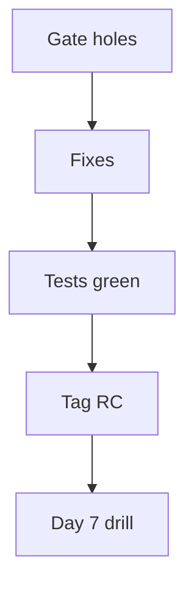

# Month 18 · Week 4 · Day 6
# Independent: Close Gaps and Freeze a Release Candidate

**Program:** Full-Stack Mastery · 18 months  
**Phase:** 7 — Capstone  
**Month index:** [../../README.md](../../README.md)  
**Week 4:** [1](day-01.md) · [2](day-02.md) · [3](day-03.md) · [4](day-04.md) · [5](day-05.md) · Day 6 (today) · [7](day-07.md)  
**Week rhythm today:** Independent implementation  
**Student state:** Docs and Compose exist. Today you **close gate holes** and **freeze** a release candidate. Tomorrow you will **break** things on purpose.  
**Study time:** 3–4 focused hours (plus a second session if CI is red — say so)

This textbook will **not** finish your product for you. Checklist + freeze protocol. Work in **your capstone**. Notes: `~\fullstack-lab\month-18\week-04\day-06\`.

---

## How to use this textbook

1. Gate-first: Month 18 README items, not new features.  
2. Freeze means a **SHA** and a **tag**, not “good enough vibes.”  
3. Known bugs go in `KNOWN.md`; they remain **fails** if they are gate items.  
4. Optional review links are for later rechecking.

---

## How to read this chapter

A release candidate is a **specific artifact** you are willing to incident-drill. A dirty working tree is not.



**Wrong belief:** “I’ll freeze after the incident drill so I can keep coding.”  
**Correct:** the drill is on the RC. Fixes during the drill become **new** commits and regression tests — still documented.

**Wrong belief:** “I’ll add WebSockets tonight because optional is tempting.”  
**Correct:** Project 8 optional tech needs justification **and** a green core. Optional after excellent core — you are not there if the gate is false.

---

## Today's contract

By the end of this day you will be able to:

1. Fill `GATE-HOLES.md` against Month 18 README + Project 8 DoD.  
2. Fix what you can; list what you **cannot** (honest).  
3. CI green on the freeze commit (or documented blocker).  
4. Tag `rc-month18` (or `rc-YYYYMMDD`) on the SHA.  
5. `RELEASE-CANDIDATE.md`: SHA, image tags, migrate revision, known bugs.  
6. Seed data instructions so Day 7 can log in.

**Today's gate.** Closed-book:

> I can name the SHA I will drill. Gate holes are visible. I did not hide a missing deny test behind a tag.

---

## Time box

| Block | Minutes | Work |
|---|---|---|
| A | 30 | Gate inventory |
| B | 20 | Freeze rules (read; write RC file header) |
| C | 120 | Close holes; tests; tag |
| D | 20 | RC document + seed |
| E | 15 | Recall |

---

# Block A — Inventory

Copy Month 18 README gate items 1–8 into `GATE-HOLES.md`. For each: **true/false**, **path**, **note**.

Also Project 8 §22 checkboxes. False rows are today’s queue. Calendar is not a row.

---

# Block B — Freeze rules

Write at top of `RELEASE-CANDIDATE.md`:

- No drive-by refactors after tag unless Day 7 requires a fix.  
- Secrets still not in git.  
- Tag the **monorepo** SHA that includes API+web.  
- Compose/images rebuilt from that SHA.

If you cannot tag (no git), **stop** and fix git. The exam requires history.

---

# Block C — Independent

Work false rows **in order of gate severity**: deny tests, journey, Compose health, CI, backups, security doc, then polish.

Do **not** start a new domain.

Commands (from repo roots as you laid out):

```powershell
uv run ruff check
uv run pytest -q
npx vitest run
npx playwright test
docker compose up --build
```

When green enough to be honest:

```powershell
git status
git log -1 --format="%H"
git tag rc-month18
```

Do not `--force` tags. Do not `--no-verify` to hide hooks unless you **write why**.

Windows: tagging works the same. Pushing tags is optional unless you need Actions; local tag is the freeze **if** solo — still record SHA.

---

# Block D — RC document

`RELEASE-CANDIDATE.md`:

| Field | Value |
|---|---|
| SHA | |
| Date | |
| Alembic head | |
| Image tags | |
| Playwright | pass/fail |
| Known non-gate bugs | |
| Seed user (no real password in git) | env names |

`SEED.md`: how to create the e2e user.

---

# Block E — Recall

1. What a freeze is.  
2. Why optional Kafka tonight is wrong.  
3. Where known bugs go.  
4. What Day 7 will do to this SHA.  
5. Why a red deny test cannot be “known.”

```powershell
cd ~\fullstack-lab
git add month-18
git commit -m "Month 18 Day 6: RC freeze notes."
```

---

## What you freeze, exactly

The freeze is not a feeling. It is:

1. A **git SHA** (full 40 characters in the RC file).  
2. A **tag** pointing at that SHA.  
3. **Images** built from that SHA, or a written command that would rebuild them **without** extra local edits.  
4. **Alembic head** revision id.  
5. **Seed** procedure that creates the drill user.  
6. A `KNOWN.md` that does **not** contain “deny test later.”

If the web app and API live in two repos, freeze **both** SHAs and write which pair was tested together. Day 7 cannot drill a moving target.

After freeze, the only legitimate new commits are **incident fixes** with regression tests. Those get a new SHA; you note “RC + hotfix” in INCIDENTS.md. You do not silently retag `rc-month18` onto unrelated work.

**Wrong belief:** “I’ll keep committing features and tag whenever.”  
**Correct:** then you have no candidate. You have a branch.

**Pre-flight (30 minutes, typed):**

```powershell
git status
git log -1 --oneline
uv run pytest -q
npx vitest run
npx playwright test
docker compose ps
```

Any red item is a hole, not a “known flake,” unless you can name the race and a ticket. Day 7 will not be kinder.

## Office hours

**Tag on a dirty tree.** Commit or stash.  
**“CI is flaky so we ignore it.”** Repair flake or the test; ignoring is a false gate.  
**Seed password in README.** Use env.  
**Rebuilding images from uncommitted edits after tag.** Then the tag is a lie — retag.  
**Optional Kafka “because Week 4 has time.”** Time is for holes and the freeze.  
**Two tags, forgot which is real.** `RELEASE-CANDIDATE.md` names one.

Windows: `git tag rc-month18` then `git show rc-month18 --quiet`. If tag exists from a failed attempt, create `rc-month18-2` rather than `--force` unless you are sure nothing else pointed at the old tag.

---

## Definition of done

- [ ] GATE-HOLES.md honest  
- [ ] Tests run  
- [ ] Tag or recorded SHA  
- [ ] RELEASE-CANDIDATE.md  
- [ ] SEED.md  
- [ ] No new optional platform  

---

## Optional review links

- [Month 18 README gate](../../README.md)  
- [Project 8 §22](../../../../full_stack_project_requirements_2026/project_08_independent_production_capstone.md)  
- [git-tag](https://git-scm.com/docs/git-tag)  

---

## Tomorrow

**Final incident drill + program gate.** This next file is the **exam teacher**. You will walk failure classes: frontend exception, API 500, database unavailable, slow query, stale cache, expired/invalid auth, failed background job, bad deploy config — plus authorization attempt as **observation of deny**, not an exploit tutorial. Then you self-mark. Honest fails stay. The calendar does not graduate you. Afterward: the mastery loop.
