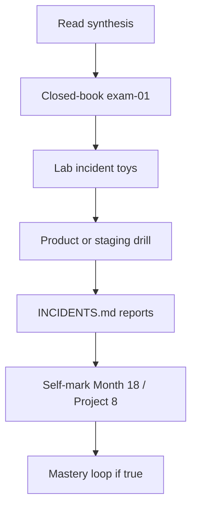
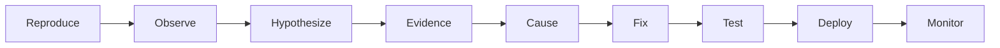

# Month 18 · Week 4 · Day 7
# Final Incident Drill + Program Gate

**Program:** Full-Stack Mastery · 18 months  
**Phase:** 7 — Capstone  
**Month index:** [../../README.md](../../README.md)  
**Week 4:** [1](day-01.md) · [2](day-02.md) · [3](day-03.md) · [4](day-04.md) · [5](day-05.md) · [6](day-06.md) · Day 7 (today)  
**Week rhythm today:** Program examination  
**Study time:** 3–4 focused hours **plus** a second session if the drill or gate is incomplete. Say so in the log. The calendar does not graduate you.

Textbook files stay **closed** except:

- **this file** (synthesis + drill blocks + self-mark tables),
- [Month 18 README](../../README.md) **for the gate wording**,
- [Project 8](../../../../full_stack_project_requirements_2026/project_08_independent_production_capstone.md) **headings** if you must recall what the exam contains — not as a source to paste a product,
- your **own** `OPERATIONS.md`, `INCIDENTS.md`, and `RELEASE-CANDIDATE.md` in the blocks that say so.

Repair forgotten operations from **this synthesis**, not from a random SRE blog and not from Weeks 1–4 day files during Blocks 1–3.

Work in `~\fullstack-lab\month-18-exam\` for exam evidence **and** in **your capstone** `docs/INCIDENTS.md` for product drills. Lab toys are **imposed domains**. Do **not** implement exam minis inside a second copy of the whole capstone. After a **true** gate, the **mastery loop** (roadmap §10) begins.

This book teaches **diagnosis and defense**. It does not teach you to attack systems you do not own. Authorization “attempts” mean **you** call your API as the wrong user the way your **tests already do**.

---

## How to read this chapter

This file is the **exam and the teacher**. A student whose month is foggy can re-learn the standard from **today’s pages**, then prove it with the drill and an **honest** gate table.



During Blocks 1–2, other day files stay closed. If you go blank, re-read **this synthesis**. AI may not write exam-01, incident reports, or the gate table.

---

## Today's contract

By the end of this day you will be able to teach Month 18 aloud from this synthesis, walk the **failure classes** with the nine-step method, fill `INCIDENTS.md`, and **honestly** mark the Month 18 / Project 8 gate.

**Today's gate** is the Month 18 Gate table below — not “I attended four weeks.” If any required row is false, **you are not done with the core program**. Repair. Retake the drill for the missing classes.

---

## Time box

| Block | Minutes | Work |
|---|---|---|
| 0 | 25 | Read the complete explanation; speak it |
| 1 | 30 | Closed-book `exam-01.md` |
| 2 | 50 | Lab toys for classes you cannot safely break on staging |
| 3 | 90 | Product/staging drill + `INCIDENTS.md` |
| 4 | 20 | Architecture challenge (Project 8 §18) on paper |
| 5 | 20 | Demonstration rehearsal list (Project 8 §21) |
| 6 | 25 | Retro + self-mark both tables |

If Block 3 needs a second session, take it. Do not skip reports.

---

## Month 18 synthesis (the lesson, in this book)

Month 18 is the **core-program examination**. You built **Project 8** from a **blank repository** and a **business problem you chose**. This textbook never picked your domain, never pasted a capstone, never issued a clinic schema. Good *classes* of problem: multi-tenant work, appointments, logistics, tickets, events, B2B CRM. Avoid: todo, weather, simple blog, movie search. Reusing Project 7 as a skin is a fail. Microservices without a demonstrated need are a fail. Default: **modular monolith**.

**Week 1 — docs before substantial code.** Stranger paragraph. User types with a **deny**. ≥12 meaningful stories (jobs, not CRUD-twelve). NFRs with **numbers**. Invariants, ER, justified indexes, API outline (authz matrix, pagination, 401/403/404/409/422). Architecture, trust boundaries, Month 13 threat model, Month 14 pyramid, Months 15–16 deploy plan. Wireframes as boxes; filters in the URL. `DESIGN-PACK.md` is the cover sheet.

**Week 2 — backend.** uv, Ruff, pytest, env config, **no secrets in git**, Alembic from **your** spec. Password **hashes**. Session or tokens **as the pack said**. Tests that **deny** the wrong user. Related CRUD; list mechanics practiced on **rooms/bookings** and **ported**. Job + worker, retries, idempotency, structured logs, **request_id**. Files behind a port, mailer port, audit for one important action.

**Week 3 — frontend.** Vite, TypeScript, **`react-router`**, Query **v5**, `VITE_API_BASE`, typed client that **throws** on 403. URL filters. RHF forms. No Redux unless justified. Keyboard, labels, 403 UI. RTL+MSW. Playwright critical journey. A **person** can finish the job.

**Week 4 — production.** Compose: **non-root**, health/ready, volumes, env. CI/CD, secrets store, HTTPS truth, **migrations as a step**, rollback honesty. Runbook: deploy, rollback, logs, **you** on-call. Monitoring; backup **strategy**; restore **rehearsal**; small load test; performance note (baseline, bottleneck, change, result). Security review on **this** product. Operator docs. **Release candidate SHA**. Then **this drill**.

**Incident method (every class):**

1. **Reproduce** (lab toy and/or staging — controlled).  
2. **Observe** (user-visible + health).  
3. **Hypothesize** (two causes, not one superstition).  
4. **Inspect evidence** (logs with request_id, metrics, traces of thought).  
5. **Root cause** (one sentence).  
6. **Fix**.  
7. **Regression test** (cheapest layer that would catch it).  
8. **Deploy** (same SHA discipline).  
9. **Monitor** (watch the signal that detected it).

**Wrong belief:** “I restarted Docker and the incident is done.”  
**Correct:** without root cause, a test, and a report, you performed folklore.

**Wrong belief:** “Authorization drill means I write an attack tool.”  
**Correct:** you run **your** deny test and a manual `TestClient`/browser login as User B. You record that 403 held. You do not probe strangers’ systems.

---

# Complete explanation — failures you must still own

## Frontend exception

A thrown render or an unhandled promise. Observe: blank page vs error boundary. Evidence: browser console, any reporter you added, request_id if the API also failed. Fix: error boundary + test if the bug is in **your** code. Do not leave `ErrorBoundary` that swallows 403 lists.

## API 500

An unhandled exception in a path operation. Observe: 500, error logs. Hypothesize: None dereference vs DB vs bug. Fix the cause; do not hide with `except Exception: return []`. Regression: TestClient that hits the condition.

## Database unavailable

Stop Postgres in Compose **on a machine you own**, or point a **lab** app at a closed port. Observe: ready red, API errors. Hypothesize: wrong host vs process dead. Inspect: connection errors, **not** HTML. Fix: restart; **ready** check should have gone red (if it stayed green, that is a second bug — health lied).

## Slow query

Lab: omit an index or add `pg_sleep` **in a toy**. Product: EXPLAIN a hot list. Observe: p95, timeout. Fix: index you **justified**, or query rewrite. Performance note may already exist — today prove you can **see** slowness.

## Stale cache

If you have Redis/cache: serve stale after update, or stop Redis and watch **degradation** (Month 17). If you have **no** cache, drill **Query cache**: mutate without `invalidateQueries` in a **lab component**, observe stale list, fix invalidation. Do not invent Redis for the exam tonight.

## Expired / invalid auth

Expired session/token; malformed cookie; logged-out `/me`. Observe: 401, UI to login, **not** a crash loop. Regression: TestClient.

## Failed background job

Poison message or mailer port raising. Observe: job `failed`, logs, user-visible “queued” vs silent loss. Fix: retry/idempotency/visibility. Regression: worker unit test.

## Bad deploy config

Classic: `DATABASE_URL` uses `127.0.0.1` **inside** the API container; CORS origin mismatch; worker missing env; `Secure` cookies on HTTP. Observe: login fail, health maybe still 200. Fix config; add a checklist line to the runbook.

## Authorization (deny) — defensive

As User B, open User A’s detail URL. Observe: 403 UI + API 403. Evidence: deny test name. If 200, the gate is **false**. You do **not** write a scanner.

---

# Block 0 — Speak the synthesis

Out loud, no other files: blank repo; pack first; deny tests; jobs and request_id; Query vs RHF; Compose non-root; migrate step; nine-step incident method; calendar does not graduate. Then Block 1.

---

# Block 1 — Closed-book (30 min)

Create `~\fullstack-lab\month-18-exam\exam-01.md`.

Write **in your words** (30–45 lines):

1. Your problem in the stranger paragraph.  
2. Modular monolith — one extra box you added **or** none.  
3. How you deny the wrong user (test name).  
4. How you follow one request_id.  
5. RPO/RTO honesty.  
6. The RC SHA (from memory or “I will look in Block 3”).  
7. Nine incident steps in order.

If you cannot fill it, re-read the synthesis. Do not open Day 6 yet except the SHA in Block 3.

---

# Block 2 — Lab toys (50 min)

```powershell
cd ~\fullstack-lab
mkdir month-18-exam\toys -Force
cd ~\fullstack-lab\month-18-exam\toys
```

You will **not** finish eight production-grade apps. You will finish **small** reproductions so every **class** has evidence even if staging is thin.

**Toy A — API 500 + request id.** FastAPI route `GET /boom` raises `RuntimeError("lab")`. Middleware adds `X-Request-ID`. Test: status 500 and header present. Then **fix** `/boom` to 404 or remove it; keep a test that a **deliberate** handler still logs request_id (or test the middleware via `/health`). Write `toy-a.md`.

**Toy B — database unavailable.** In the toy, a `ready()` function returns false if `os.environ.get("DB_UP") != "1"`. Test both. This is the **shape** of a readiness check. Write `toy-b.md`.

**Toy C — stale list.** A function `cache_get()` returns old title until `invalidate()`. Unit test: after update, without invalidate, stale; with invalidate, fresh. Write `toy-c.md`.

**Toy D — bad config.** Function `db_host_from_url(url)` — you document that `127.0.0.1` **inside Compose** is a smell; test a helper `looks_like_container_localhost(url: str) -> bool` you can use in **docs**, not necessarily in prod code. Write `toy-d.md`.

```powershell
uv init --name exam-toys
uv add --dev pytest
uv add fastapi
uv add --dev httpx
uv run pytest -q
```

Windows: `uv run pytest -q`. If pytest is not recognized, you forgot `uv run`.

These toys **do not replace** product drills. They keep classes from going “N/A” without thought.

---

# Block 3 — Product / staging drill (90 min)

Open **your** RC. For **each** class in the table, either:

- reproduce on **staging/Compose you own**, or  
- point at the **lab toy** plus a paragraph **how it would appear** on your product.

Fill capstone `INCIDENTS.md` **and** `~\fullstack-lab\month-18-exam\INCIDENTS-COPY.md` using Project 8’s fields:

```text
Impact
Detection
Timeline
Root cause
Fix
Regression prevention
Follow-up
```

Plus the nine steps as a checklist per class.

| Class | Where drilled | Report id |
|---|---|---|
| Frontend exception | | I-FE |
| API 500 | | I-500 |
| Database unavailable | | I-DB |
| Slow query | | I-SQL |
| Stale cache (Redis or Query) | | I-CACHE |
| Expired/invalid auth | | I-AUTH |
| Failed background job | | I-JOB |
| Bad deploy config | | I-CFG |
| Wrong-user deny (defensive) | | I-DENY |

**Rules:**

- Restore the RC to **working** after each break. Do not leave `main` broken. Do not force-push.  
- Regression tests stay.  
- If you cannot stop production Postgres because you have **real users**, use Compose **local** or toys + written transfer. Honesty.  
- Do not attack a URL you do not operate.

**Wrong belief:** “Skipping I-DB because Docker is annoying.”  
**Correct:** `docker compose stop postgres` on **your** project is the point.

---

# Block 4 — Architecture challenge (20 min)

`exam-04-scale.md` (Project 8 §18), 12–20 lines, **your** nouns:

- 10× users — what breaks first?  
- 100× traffic — what must change?  
- Database growth — what becomes problematic?  
- Redis unavailable — what degrades? (If no Redis, say so.)  
- Worker down — what happens to queued work?  
- External provider down (mail/S3) — product behavior?

Explain **evolution**. Do not prematurely rebuild everything.

---

# Block 5 — Demonstration list (20 min)

`exam-05-demo.md`: Project 8 §21 items 1–15 as a **checklist with a one-line proof** each (path or SHA). If you cannot demo without a script, mark the item false. Practice **one** incident from Block 3 aloud.

---

# Block 6 — Retro + self-mark

`exam-07-retro.md`: weakest incident class; whether you cloned Project 7; remaining OWED.

```powershell
cd ~\fullstack-lab
git add month-18-exam
git commit -m "Complete Month 18 exam evidence."
```

Capstone: commit `INCIDENTS.md` and any regression tests.

---

## Month 18 Gate (self-mark)

True **without a tutorial**, against **your** Project 8 and the project_08 file. Evidence paths are yours.

| # | Claim | Evidence | Pass? |
|---|---|---|---|
| 1 | Design pack existed **before** substantial code: problem, users, ≥12 stories, NFRs, wireframes, ER, API, architecture, threat model, test strategy, deploy plan | DESIGN-PACK.md | |
| 2 | Backend: FastAPI + PostgreSQL + SQLAlchemy + Alembic + authn/authz + tests + structured logs; Redis/jobs where needed | tests, logs | |
| 3 | Frontend: React + TS + Router + Query + forms/validation + a11y + tests; Redux only if justified | web repo | |
| 4 | Capabilities: roles, related CRUD, search/filter/sort/pagination, object-storage feature, notification/email, background job, audit/history | checklist | |
| 5 | Docker + CI/CD + HTTPS + secrets + migrations + monitoring + backup **strategy** (restore idea) | DEPLOYMENT / BACKUP | |
| 6 | Small load test + performance note | PERFORMANCE.md | |
| 7 | Security review mapping Month 13 onto **this** product | SECURITY.md | |
| 8 | Incident drill: listed classes with reproduce→monitor notes | INCIDENTS.md | |

If any item is **false**, you are not done with the core program. Repair. **The calendar does not graduate you.**

---

## Project 8 §22 Definition of Done (self-mark)

Copy the spec’s checkboxes into `exam-08-dod.md` and tick **only** if true. Completing a calendar month is not completing the capstone.

---

## Scoring the drill (you, not a grader bot)

| Piece | Honest pass |
|---|---|
| Break was controlled on **your** lab/staging | Not someone else’s site |
| Evidence is logs/metrics/tests, not vibes | INCIDENTS.md |
| Root cause is specific | Not “Docker is bad” |
| Regression test exists when practical | pytest/Vitest/Playwright |
| System restored | compose ps healthy |
| Deny class used existing authz tests | No exploit kit |

If you “drilled” API 500 by unplugging the laptop, that is not a fixable code incident. Restore and pick a handler.

---

## Worked notes you should not need — check **after** you write reports

**Frontend exception.** Error boundary vs blank; fix the throw or the missing data guard; component test if UI.  
**API 500.** Log traceback **without** secrets; fix None; TestClient.  
**DB down.** Ready must fail; user sees error not empty success.  
**Slow query.** EXPLAIN; index already in DATABASE.md or add with justification.  
**Stale cache.** Invalidation or TTL; Query key.  
**Auth expired.** 401 + login; no crash loop.  
**Job failed.** Status visible; retry; idempotent.  
**Bad config.** localhost vs service DNS; runbook checklist.  
**Deny.** 403 still 403.

If your reports disagree, fix them from this box **only after** you attempted the drill alone.



---

## After the gate — the mastery loop

Month 18’s honest pass means you are a **production-capable independent engineer**, not a finished master. The program’s job was to make you someone who can receive a messy problem and walk requirements → architecture → data → API → UI → authz → tests → containers → CI/CD → cloud → observability → incidents → performance → security → scaling — and explain **why**, what you rejected, what fails, and how you would detect it.

What comes next is not another tutorial month in this textbook. It is the **mastery loop** in the roadmap (§10): repeated **8–12 week** cycles in which you **own** a non-trivial system. Each cycle must include building or operating under unfamiliar requirements, an architecture decision under constraints, diagnosing incidents, measuring and improving performance, upgrading dependencies safely, a security review, a refactor of an older subsystem, deploying and observing, and explaining trade-offs to another engineer. Then you broaden **selectively** — advanced PostgreSQL, distributed systems, messaging, Kubernetes, deeper AWS, frontend performance, domain-driven design, security engineering, platform/SRE — because a real system demanded it, not because a list of logos felt incomplete.

Mastery is **repeated ownership**, not collecting technologies. If today’s gate table has a false row, your next week is not Kafka. It is that row. If the table is true, pick a system worth owning — this capstone in production, a job, a volunteer platform — and start a cycle. AI may speed you; it may not replace your review of diffs, your deny tests, or your incident notes. You already know the standard. Keep using it.

---

## If you passed

You may treat the core 18-month program as **complete**. Keep Project 7 and Project 8 running. Begin an 8–12 week loop. Optional experiments (WebSockets, OpenTelemetry, Kubernetes, GraphQL) still need **written justification**.

## If you did not pass

Stay on Month 18. This synthesis remains the teacher. Repair the false row (often: no pack, no deny test, no journey, no restore idea, no incident notes). Repeat Block 3 for missing classes. Do not announce mastery on a false self-mark.

---

## Optional review links

- [Month 18 README](../../README.md)  
- [Project 8](../../../../full_stack_project_requirements_2026/project_08_independent_production_capstone.md)  
- [Roadmap §10 After Month 18](../../../../full_stack_mastery_roadmap_expert_2026.md)  

---

## Closed-book cards (write answers in exam-07-retro)

1. Why Project 7 clone fails.  
2. 401 vs 403.  
3. Why `create_all` is not a migration step.  
4. Query vs RHF.  
5. Why 403 must not become `items: []`.  
6. Non-root containers.  
7. RPO in one sentence.  
8. Nine incident steps.  
9. Who you page.  
10. The Month 18 gate in one sentence.

If you miss more than two, re-read the synthesis, then the gate table.

Do not put the toys inside the product repo as the product. Do not mark the gate true if INCIDENTS.md is empty.

## Definition of done (exam day)

- [ ] exam-01 teaches the month and names the RC  
- [ ] Lab toys pytest green enough to show method  
- [ ] INCIDENTS.md has reports for the required classes (toy transfer allowed if honest)  
- [ ] Architecture challenge written  
- [ ] Demo list honest  
- [ ] Self-mark tables honest  
- [ ] Core program not declared complete on a false row  

The gate table is the course’s definition of done for Month 18. Attendance is not. The mastery loop starts when the table is true.
